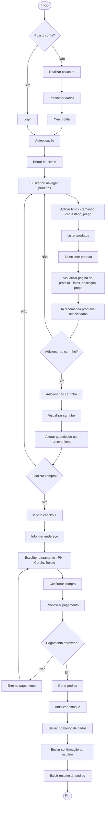

```mermaid
flowchart TD

    A([Início]) --> B{Possui conta?}

    B -->|Não| C[Realizar cadastro]
    C --> C1[Preencher dados]
    C1 --> C2[Criar conta] 
    C2 --> D[Autenticação]

    B -->|Sim| E[Login]
    E --> D
  
    D --> F[Entrar na Home]

    F --> G[Buscar ou navegar produtos]
    G --> H[Aplicar filtros - tamanho, cor, estado, preço]
    H --> I[Listar produtos]
    I --> J[Selecionar produto]

    J --> K[Visualizar página do produto - fotos, descrição, preço]
    K --> L[IA recomenda produtos relacionados]

    L --> M{Adicionar ao carrinho?}
    M -->|Não| G
    M -->|Sim| N[Adicionar ao carrinho]

    N --> O[Visualizar carrinho]
    O --> P[Alterar quantidade ou remover itens]

    P --> Q{Finalizar compra?}
    Q -->|Não| G
    Q -->|Sim| R[Ir para checkout]

    R --> S[Informar endereço]
    S --> T[Escolher pagamento - Pix, Cartão, Boleto]
    T --> U[Confirmar compra]

    U --> V[Processar pagamento]
    V --> W{Pagamento aprovado?}

    W -->|Não| X[Erro no pagamento]
    X --> T

    W -->|Sim| Y[Gerar pedido]
    Y --> Z[Atualizar estoque]

    Z --> A1[Salvar no banco de dados]
    A1 --> A2[Enviar confirmação ao usuário]
    A2 --> A3[Exibir resumo do pedido]

    A3 --> A4((Fim))
```